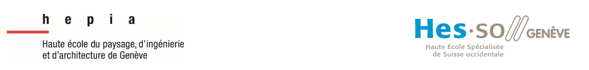
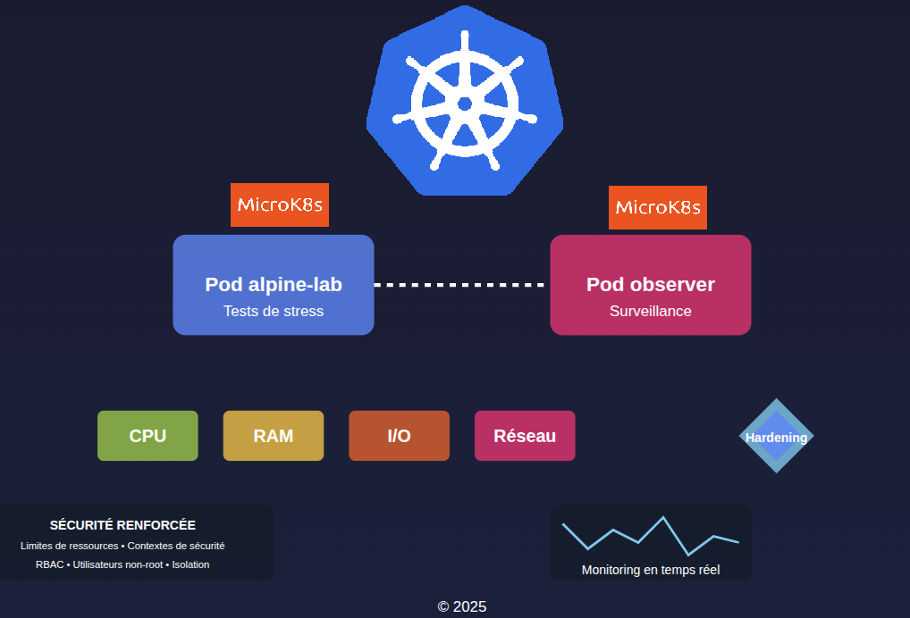
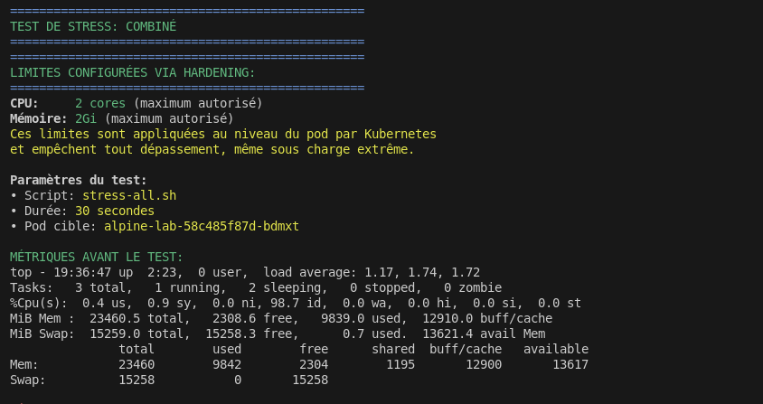
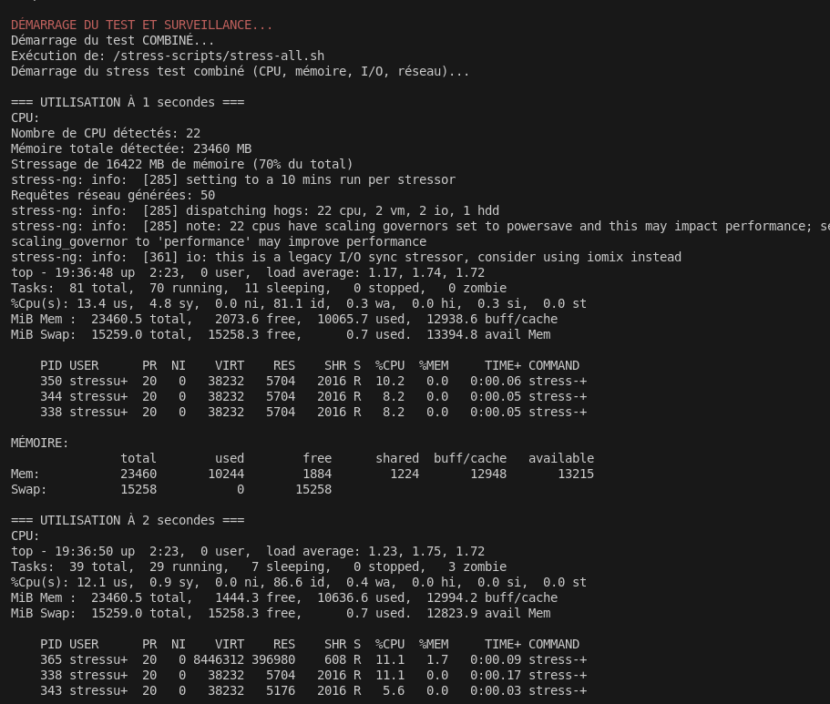
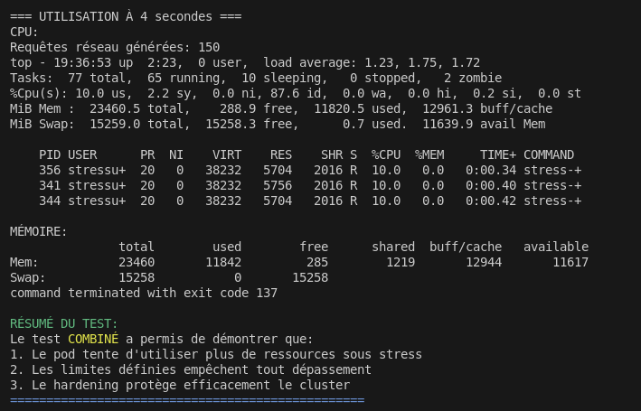

# Rapport de Tests de Hardening MicroK8s

Ce projet a été réalisé dans le cadre du cours "**Services et application des systèmes d'information**" par:

- Arthur Cayuso
- William Viret 
-  Soufiane El Kharmoudi 
- Omar Alkheja 

[TOC]

### Résumé

Notre travail évalue l'efficacité des mesures de sécurité (hardening) implémentées dans un environnement Kubernetes léger (MicroK8s). 

À travers une série de tests de stress contrôlés, nous avons démontré que les mécanismes de protection configurés maintiennent l'intégrité et la stabilité du système, même face à des charges extrêmes. 

Les résultats confirment l'importance cruciale d'une configuration sécurisée pour les environnements conteneurisés en production.

Github : https://github.com/Sterdam/microk8s

## Mesures de Hardening Implémentées

### Limites de Ressources:

- **CPU**: 2 cores maximum
- **Mémoire**: 2Gi maximum
- Ces limites sont appliquées au niveau du pod par Kubernetes

### Isolation et Sécurité:

- Exécution sous utilisateur non-root (UID 1000)
- Namespace dédié (`stress-test`)
- RBAC avec permissions minimales
- SecurityContext restrictif (`capabilities DROP: ALL`)
- Désactivation de l'escalade de privilèges

## Résultats des Tests

### Métriques initiales avant test de stress - Résumé

Avant le lancement du test, le système est configuré avec des mesures de hardening qui limitent strictement les ressources (2 cœurs CPU, 2Gi mémoire). L'environnement présente une charge modérée (load average ~1.7) avec une utilisation minimale des ressources : à peine 1% du CPU est utilisé et seulement environ 10% des 23GB de mémoire disponible sont consommés.

Les métriques initiales révèlent un système stable avec d'abondantes ressources disponibles, configuré avec des limites strictes qui seront mises à l'épreuve par un test intensif simulant une tentative d'utilisation excessive des ressources.

### Métriques pendant le test de stress - Résumé

Dès le lancement du test combiné, le script `stress-all.sh` mobilise simultanément plusieurs ressources système en initialisant 22 processus CPU et en ciblant 16422 MB de mémoire (70% du total disponible). À la première seconde, le système enregistre une augmentation significative d'activité (81 tâches avec 70 en exécution) et une utilisation CPU de 18.2% (13.4% user + 4.8% system), chaque processus stress étant limité à environ 10% de CPU. À la deuxième seconde, la mémoire libre diminue notablement, passant à 1444 MB, soit une réduction d'environ 600 MB en une seconde.

Les données collectées pendant le test montrent que les mécanismes de limitation restreignent efficacement l'utilisation CPU à environ 10% par processus malgré la sollicitation des 22 cœurs détectés, tandis que la consommation mémoire augmente rapidement, conformément aux objectifs du test de charge.

### Métriques à 4 secondes et fin du test - Résumé

À T+4 secondes, le système maintient une charge stable (load average: 1.23, 1.75, 1.72) avec 77 processus actifs dont 65 en exécution. L'utilisation CPU reste contrôlée à environ 10% par processus stress-ng, confirmant l'efficacité des limites fixées. Cependant, la mémoire disponible atteint un seuil critique avec seulement 288.9 MB libres et 11820.5 MB utilisés. Le test se termine peu après avec un code de sortie 137 (SIGKILL), indiquant une intervention de l'OOM Killer de Kubernetes lorsque la consommation mémoire a atteint la limite configurée de 2Gi.

Les observations finales confirment que les mesures de hardening fonctionnent comme prévu : les limitations CPU sont respectées tout au long du test, tandis que le mécanisme de protection mémoire termine automatiquement les processus lorsqu'ils tentent de dépasser les ressources allouées, préservant ainsi l'intégrité du cluster.

### Test de Stress Combiné

Le test combiné a démontré:

**Utilisation CPU:**

- Malgré une tentative d'utiliser tous les CPU disponibles (22 détectés), chaque processus a été limité à environ 10%
- La charge totale est restée sous contrôle conformément aux restrictions définies (load average stable)

**Utilisation Mémoire:**

- Augmentation progressive de l'utilisation mémoire (de 2.3GB à 11.8GB en 4 secondes)
- Lors du pic de charge, tentative d'allocation de 70% de la mémoire totale
- Le pod a été terminé avec un code 137 (OOM killer) lorsqu'il a atteint sa limite de 2Gi

**Opérations I/O et Réseau:**

- Génération de 150 requêtes réseau contrôlée
- Opérations I/O limitées sans impact sur la stabilité du système

### Conclusions

**Efficacité du Hardening:**

- Les limites de ressources ont correctement empêché la surallocation de CPU
- Le mécanisme OOM de Kubernetes a terminé le processus lorsque la limite mémoire a été atteinte
- L'exécution sous un utilisateur non privilégié a fonctionné comme prévu

**Protection du Cluster:**

- Les tentatives d'utilisation intensive des ressources ont été confinées au pod
- Aucun impact visible sur le reste du cluster

Le test démontre que les mesures de hardening ont efficacement protégé l'environnement Kubernetes contre une utilisation excessive des ressources tout en garantissant l'isolation et la sécurité du système.